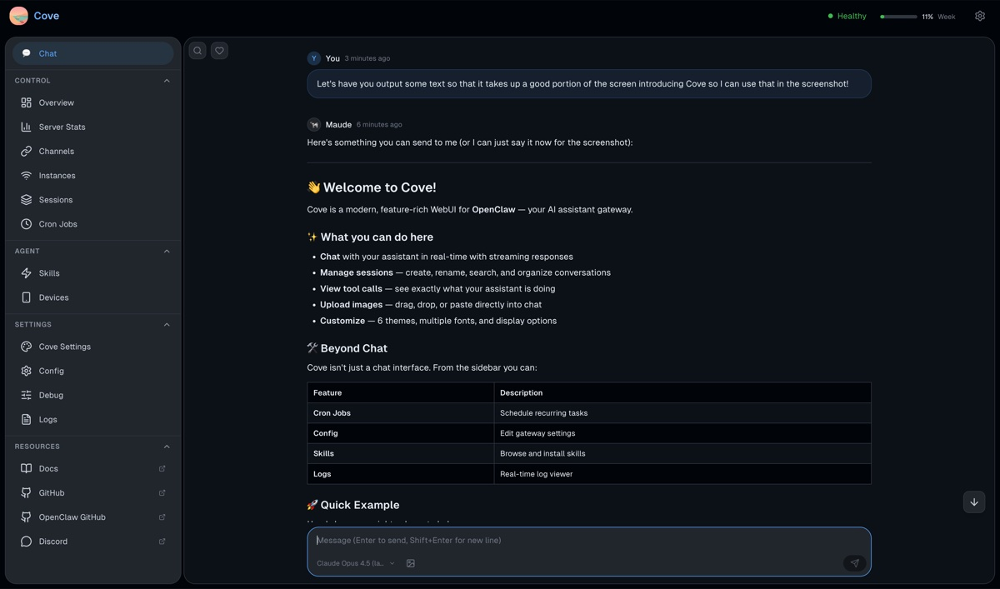
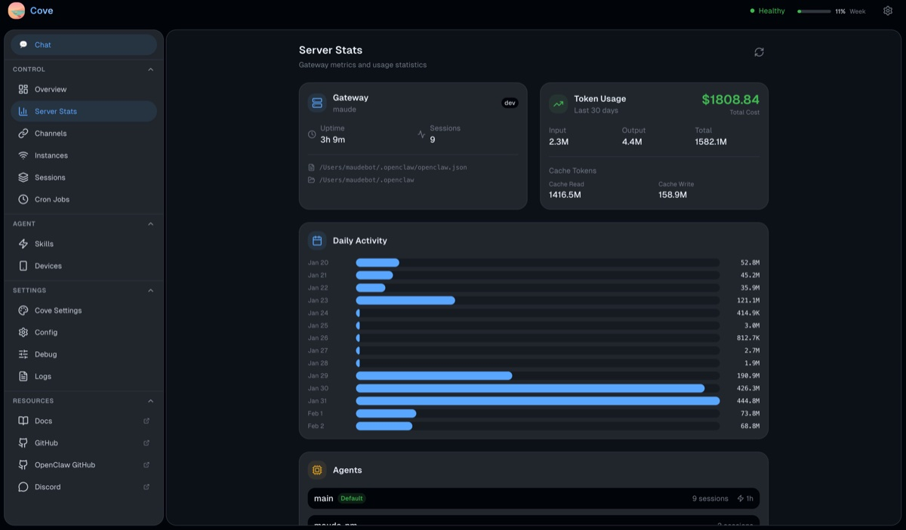
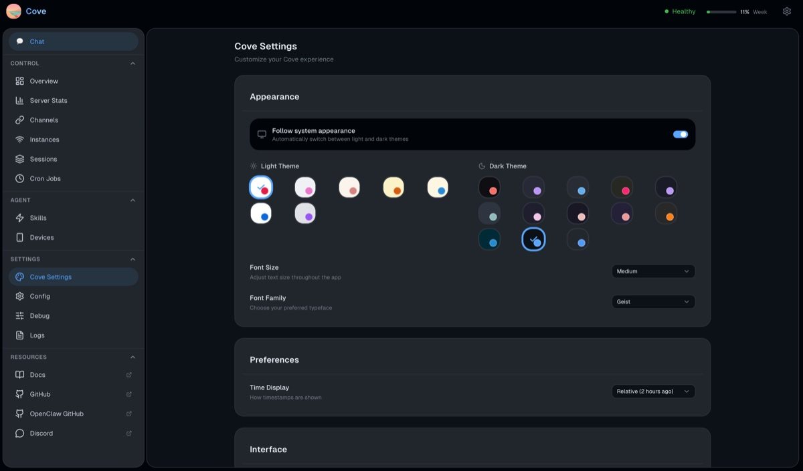

<p align="center">
  
</p>

<p align="center">
  A beautiful, full-featured WebUI for <a href="https://github.com/openclaw/openclaw">OpenClaw</a>
</p>

<p align="center">
  <a href="https://www.npmjs.com/package/@maudecode/cove"></a>
  <a href="https://github.com/MaudeCode/cove/actions/workflows/ci.yml"></a>
  <a href="./LICENSE"></a>
</p>

<p align="center">
  <a href="#-features">Features</a> •
  <a href="#-quick-start">Quick Start</a> •
  <a href="#-development">Development</a> •
  <a href="#-contributing">Contributing</a>
</p>

---

## ✨ Features

### 💬 Chat
- **Real-time streaming** — Watch responses flow in with live markdown rendering
- **Tool call visualization** — See what your assistant is doing with expandable tool details
- **Syntax highlighting** — Beautiful code blocks with one-click copy
- **File upload** — Drag & drop or paste images directly into chat
- **Message search** — Find anything with text search and date filters
- **Session management** — Create, rename, delete, and organize conversations

### 🎛️ Operations Dashboard
- **Cron Jobs** — Create and manage scheduled tasks with visual editors
- **Config Editor** — Full configuration editing with schema validation and diff view
- **Sessions Admin** — View all sessions with stats, filters, and bulk actions
- **Channels** — Monitor all messaging channels (Telegram, Discord, Signal, etc.)
- **Skills Browser** — Browse local and [ClawHub](https://clawhub.ai) skills, install with one click
- **Devices** — Manage paired devices, approve pairing requests
- **Logs** — Real-time log viewer with level filtering and search
- **Debug** — RPC tester, event stream, connection diagnostics

### 🎨 Customization
- **12 themes** — Light, Dark, Nord, Dracula, Catppuccin, Tokyo Night, and more
- **System sync** — Automatically switches with your OS preference
- **Font options** — System, Geist, Inter, JetBrains Mono, OpenDyslexic
- **Adjustable sizing** — Small, medium, or large text

### 🔒 Security
- **Exec approval** — Interactive modal for shell command approvals
- **Secure storage** — Credentials stored in browser localStorage
- **No telemetry** — Your data stays on your gateway

## 📸 Screenshots

<details>
<summary><strong>Chat Interface</strong></summary>

</details>

<details>
<summary><strong>Server Stats</strong></summary>

</details>

<details>
<summary><strong>Settings</strong></summary>

</details>

<details>
<summary><strong>Configuration Editor</strong></summary>

</details>

## 🚀 Quick Start

### Option 1: npx (Easiest)

```bash
npx @maudecode/cove
```

Then open http://localhost:8080 and connect to your OpenClaw gateway.

### Option 2: Docker

```bash
docker run -d -p 8080:8080 ghcr.io/maudecode/cove:latest
```

### Option 3: Static Hosting

Download the latest release and serve the `dist/` folder with any static file server:

```bash
# Using Python
cd dist && python -m http.server 8080

# Using Node
npx serve dist -p 8080

# Using Caddy
caddy file-server --root dist --listen :8080
```

### Option 3: Build from Source

```bash
git clone https://github.com/MaudeCode/cove.git
cd cove
bun install
bun run build
```

The built files will be in `dist/`.

## 📱 Connecting to Your Gateway

1. Open Cove in your browser
2. Enter your OpenClaw gateway URL (e.g., `wss://your-gateway.example.com`)
3. Choose authentication method:
   - **Token** — Use your gateway token
   - **Password** — Use the configured password
4. Click Connect

**First time?** The onboarding wizard will guide you through setup.

## 💻 Development

```bash
# Install dependencies
bun install

# Start dev server
bun run dev

# Run all checks (lint, format, typecheck, unused exports)
bun run check

# Build for production
bun run build
```

### Project Structure

```
src/
├── components/
│   ├── ui/           # Reusable primitives (Button, Modal, Card, etc.)
│   ├── chat/         # Chat interface components
│   └── layout/       # App shell, sidebar, navigation
├── views/            # Page components (ChatView, CronView, etc.)
├── lib/              # Core utilities (gateway client, i18n, theme)
├── signals/          # Preact Signals state management
├── hooks/            # Custom Preact hooks
├── types/            # TypeScript definitions
└── locales/          # Translation files
```

### Tech Stack

| Technology | Purpose |
|------------|---------|
| [Preact](https://preactjs.com/) | UI framework (~3KB) |
| [Preact Signals](https://preactjs.com/guide/v10/signals/) | Reactive state |
| [Tailwind CSS v4](https://tailwindcss.com/) | Styling |
| [Vite](https://vitejs.dev/) | Build tooling |
| [TypeScript](https://www.typescriptlang.org/) | Type safety |
| [marked](https://marked.js.org/) | Markdown rendering |
| [Prism](https://prismjs.com/) | Syntax highlighting |

## 🤝 Contributing

Contributions are welcome! Please:

1. Fork the repository
2. Create a feature branch (`git checkout -b feat/amazing-feature`)
3. Make your changes
4. Run checks (`bun run check`)
5. Commit with conventional commits (`feat:`, `fix:`, `docs:`, etc.)
6. Open a Pull Request

See [ROADMAP.md](./ROADMAP.md) for planned features and areas needing help.

## 📋 Requirements

- **OpenClaw gateway** v0.9+ running and accessible
- **Modern browser** with WebSocket support (Chrome, Firefox, Safari, Edge)

## 🐛 Known Limitations

- File uploads are image-only (PDF, text files coming soon)
- Multi-tab sync for user messages requires page refresh
- Assistant-generated images display as file paths (gateway enhancement planned)

## 📄 License

MIT — see [LICENSE](./LICENSE) for details.

## 🔗 Links

- [OpenClaw Documentation](https://docs.openclaw.ai)
- [OpenClaw GitHub](https://github.com/openclaw/openclaw)
- [ClawHub Skills](https://clawhub.ai)
- [Discord Community](https://discord.com/invite/clawd)

---

Built with 🐄 by [Maude](https://github.com/MaudeCode) and [Kilian](https://github.com/kiliantyler)
